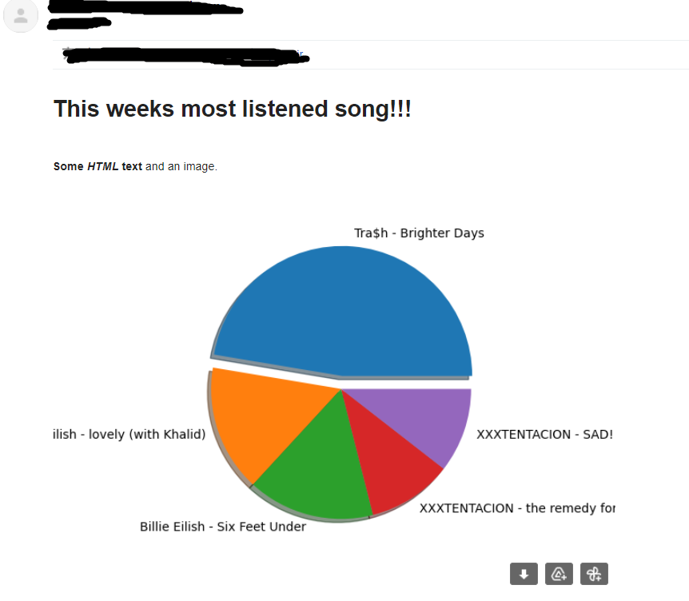

# Spotify Weekly Report
Simple python app to send your weekly Spotify stats.

## Example mail




## Steps to follow 

- Create virtual env
    - python3 -m venv venv or virtualenv venv
    - souce venv/bin/activate
    - pip install -r requirements.txt

- Create config.env under config folder
    - Enter credentials as shown in config.env.example

- READ
    - READ Spotipy docs --> https://spotipy.readthedocs.io/en/2.19.0/#getting-started
    - READ SQLİTE --> https://www.servermania.com/kb/articles/install-sqlite/
    - READ Python smtplib --> https://www.freecodecamp.org/news/send-emails-using-code-4fcea9df63f/


## How to run
```
python run.py --option daily_history_push
python run.py --option weekly_report
```

## Schedule @Crontab
```
0 10 * * *  $PATH_TO_PROJECT_FOLDER/venv/bin/activate && $PATH_TO_PROJECT_FOLDER/run.py daily_history_push   -- # Everyday “At 10:00.”
0 11 * * 1  $PATH_TO_PROJECT_FOLDER/venv/bin/activate && $PATH_TO_PROJECT_FOLDER/run.py weekly_report        -- # Everyweek “At 11:00.”
```